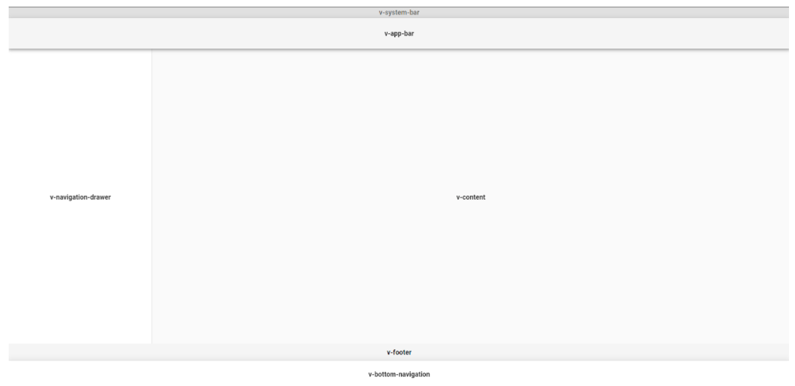
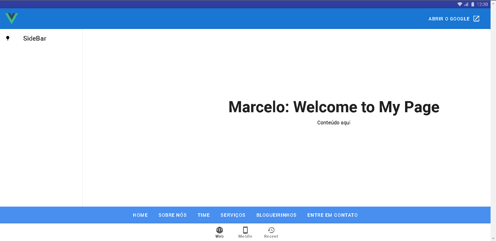
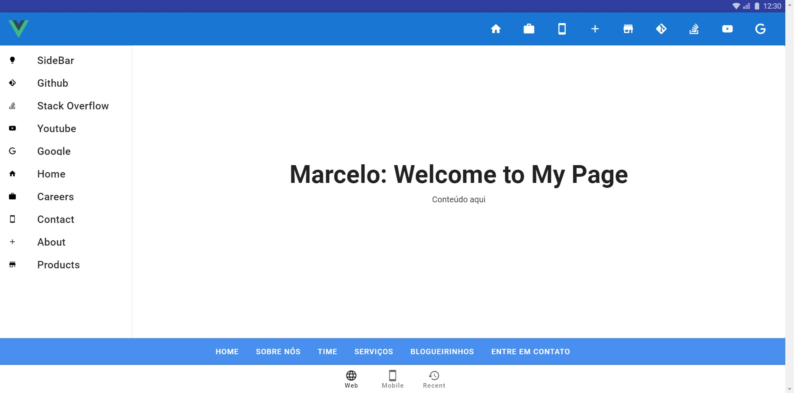
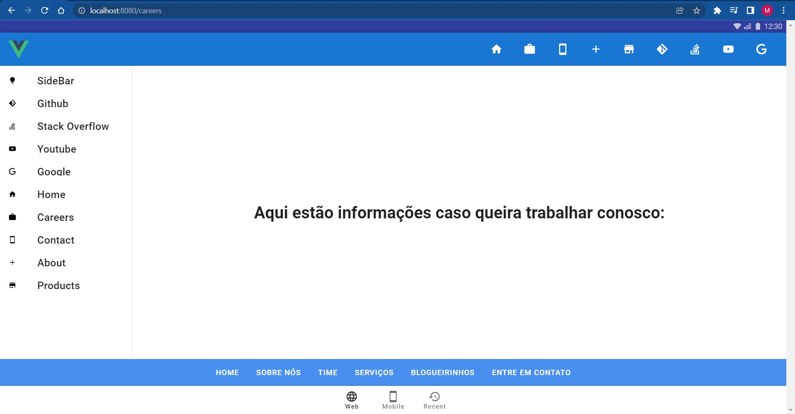
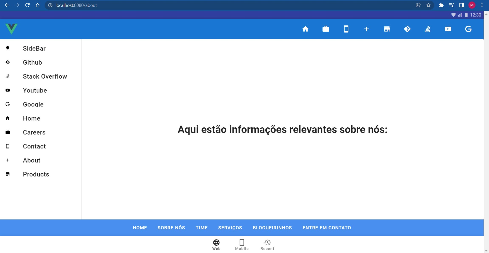
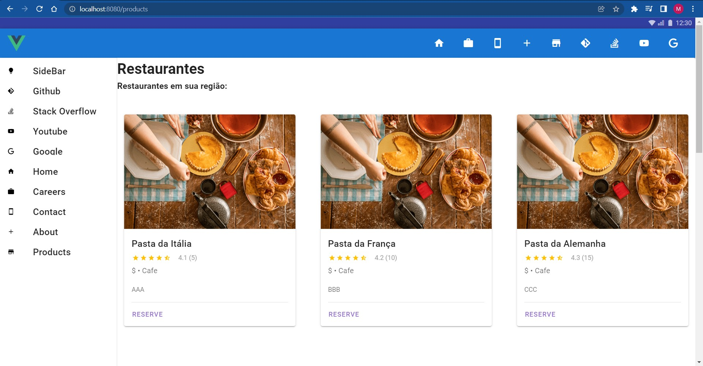

# dev-web-vue

## Objetivo
O objetivo desse projeto é desenvolver uma página utilizando o Vuetify e o wireframe desenvolvido pelo professor.



Utilizando a documentação e pesquisando foi possível chegar nesse resultado:



## AF2
Para a AF2 serão alguns objetivos a serem cumpridos, como:
- Toolbar com 4 items nela. Esse componente tem que ser importado no App.vue

- Drawer com os mesmos 4 items nela. 

- No index do ROUTER, criar 4 rotas diferentes que mostrem .vue diferentes

- No index ja  STORE, criar no state um array de 8 objetos que tenham vários parámetros.

- Criar um componente utilizando a CARD que utilize os parámetros da store de forma dinâmica.

## Prints de como ficaram as telas
- Toolbar com 4 items nela. Esse componente tem que ser importado no App.vue

- Drawer com os mesmos 4 items nela. 
    - Foi adicionado 8 items, 4 links externos e 4 rotas internas.
        - As rotas externas são Github, StackOverflow, Youtube e Google.
        - As rotas Internas são Home, Careers, Contact, About, Products

    

- No index do ROUTER, criar 4 rotas diferentes que mostrem .vue diferentes
    
    
    
    
    

- No index ja  STORE, criar no state um array de 8 objetos que tenham vários parámetros.
    - Código retirado do arquivo ```@/store/index.js```
    ```
        import Vue from 'vue'
        import Vuex from 'vuex'

        Vue.use(Vuex)

        export default new Vuex.Store({
        state:{
            titleView:"Restaurantes em sua região:",
            bigTitle: "Restaurantes",
            restaurants: [
            {
            text: 'Pasta da Itália',
            rating: 4.1,
            nRating: 5,
            description: 'AAA'
            },
            {
            text: 'Pasta da França',
            rating: 4.2,
            nRating: 10,
            description: 'BBB'
            },
            {
            text: 'Pasta da Alemanha',
            rating: 4.3,
            nRating: 15,
            description: 'CCC'
            },
            {
            text: 'Pasta da Suiça',
            rating: 4.4,
            nRating: 20,
            description: 'DDD'
            },
            {
            text: 'Pasta de Portugal',
            rating: 4.5,
            nRating: 25,
            description: 'FFF'
            },
            {
            text: 'Pasta da Espanha',
            rating: 4.6,
            nRating: 30,
            description: 'GGG'
            },
            {
            text: 'Pasta da Inglaterra',
            rating: 4.7,
            nRating: 35,
            description: 'HHH'
            },
            {
            text: 'Pasta da Escocia',
            rating: 4.7,
            nRating: 40,
            description: 'III'
            }
            ]
        },
        mutations:{},
        actions:{},
        getters: {},
        })
- Criar um componente utilizando a CARD que utilize os parámetros da store de forma dinâmica.
    - Todos os componentes gerados na página StoreProducts.vue são gerados dinamicamente através dos dados da STORE de acordo com a imagem:
    

    - Código retirado do arquivo  ```@/views/products.vue```:
    ```
    <template lang="html">

        <div>
            <h1>{{bigTitle}}</h1>
            <h3>{{applicationTitle}}</h3>
            <v-row>
            <v-col
                v-for="(n,i) in 8"
                :key="n"
                cols="12"
                sm="4"
            >
                <StoreProducts 
                :textRestaurants="myCards[i].text"
                :ratingRestaurants="myCards[i].rating"
                :nRatingRestaurants="myCards[i].nRating"
                :restaurantDescription="myCards[i].description"
                />
            </v-col>
            </v-row>
        </div>

    </template>

    <script lang="js">
    import StoreProducts from '../components/StoreProducts.vue'

    export default  {
        name: 'Products',
        components:{
        StoreProducts
        },
        data () {
        return {}
        },
        computed:{
        myCards(){
            return this.$store.state.restaurants
        },
        applicationTitle(){
            return this.$store.state.titleView
        },
        bigTitle(){
            return this.$store.state.bigTitle
        }
        },
    }
    </script>
    ```
    - Código retirado do arquivo ```@/components/StoreProducts.vue```
    ```
        <template lang="html">

        <div>
            <v-card
            :loading="loading"
            class="mx-auto my-12"
            max-width="374"
            >
            <template slot="progress">
                <v-progress-linear
                color="deep-purple"
                height="10"
                indeterminate
                ></v-progress-linear>
            </template>

            <v-img
                height="250"
                src="https://cdn.vuetifyjs.com/images/cards/cooking.png"
            ></v-img>

            <v-card-title>{{textRestaurants}}</v-card-title>

            <v-card-text>
                <v-row
                align="center"
                class="mx-0"
                >
                <v-rating
                    :value="4.5"
                    color="amber"
                    dense
                    half-increments
                    readonly
                    size="14"
                ></v-rating>

                <div class="grey--text ms-4">
                    {{ratingRestaurants}} ({{nRatingRestaurants}})
                </div>
                </v-row>

                <div class="my-4 text-subtitle-1">
                $ • Cafe
                </div>

                <div>{{restaurantDescription}}</div>
            </v-card-text>

            <v-divider class="mx-4"></v-divider>

            <v-card-actions>
                <v-btn
                color="deep-purple lighten-2"
                text
                @click="reserve"
                >
                Reserve
                </v-btn>
            </v-card-actions>
            </v-card>
        </div>

        </template>

        <script lang="js">

        export default  {
            name: 'StoreProducts',
            props: [
            'textRestaurants',
            'ratingRestaurants',
            'nRatingRestaurants',
            'restaurantDescription'
            ],
            data () {
            return {

            }
            },
        }
        </script>
    ```

## AF3
- VUEX instalado e utilizando no App.vue

- Uso de uma função getter para interação com a Store.

- Uso de uma função mutations para interação com a Store.

- Uso de uma função actions para interação com a Store.

- Uso de algum método dos existentes no ciclo de vida do Vue.

- Utilização do fetch ou axios para interação com API externa.

- Utilizar os dados consumidos da API externa para criar uma Grid, Table ou layout com Cards que mostrem os dados da requisição. 

## Prints de como ficaram as telas

- VUEX instalado e utilizando no App.vue
    - Código retirado do arquivo
    ```@/App.vue```
    

Foi escolhido como API externa para consumo a API do ViaCEP.
Seguindo o padrão: 
```
https://viacep.com.br/ws/${CEP}/json/
```

## Project setup
```
npm install
```

### Compiles and hot-reloads for development
```
npm run serve
```

### Compiles and minifies for production
```
npm run build
```

### Lints and fixes files
```
npm run lint
```

### Customize configuration
See [Configuration Reference](https://cli.vuejs.org/config/).
